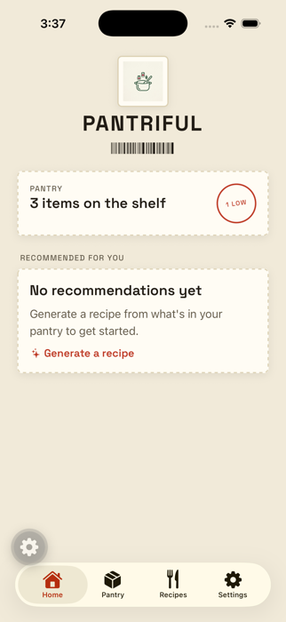
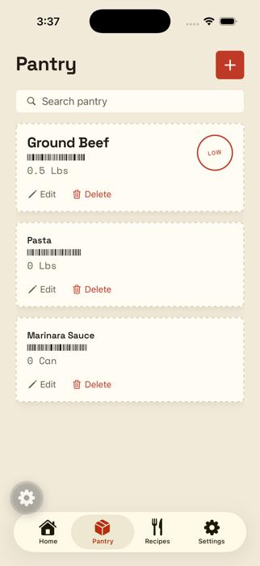
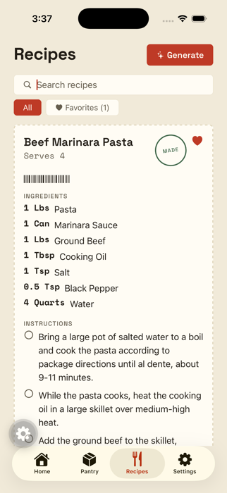
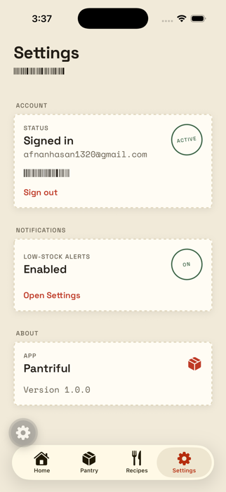

# Pantriful

**A kitchen inventory app that turns what's actually in your pantry into recipes you can cook right now.**

Pantriful tracks quantity-level pantry inventory (manual entry, camera photo ID, receipt scanning, barcode lookup) and ties it directly to AI recipe generation: recipes are built from your real current stock, each ingredient is linked back to a specific inventory row, and marking a recipe "made" transactionally decrements the exact quantities used. Low-stock items get flagged and, if you're running low, pushed to your phone.

React Native / Expo client, a Spring Boot + PostgreSQL REST API, and the Anthropic API for structured recipe generation, photo identification, and receipt parsing.

> Personal project built to a real-product bar — not yet published to the App Store.

---

## Screenshots

<table>
<tr>
<td align="center" width="25%"><br/><sub>Home — pantry snapshot &amp; recommendations</sub></td>
<td align="center" width="25%"><br/><sub>Pantry — inventory &amp; low-stock alerts</sub></td>
<td align="center" width="25%"><br/><sub>Recipes — AI-generated, checklist steps</sub></td>
<td align="center" width="25%"><br/><sub>Settings — account &amp; notifications</sub></td>
</tr>
</table>

---

## Core features

- **Multi-modal inventory entry** — add items manually, snap a photo for AI identification, scan a grocery receipt and review a parsed line-item list before committing, or scan a barcode against a cached [Open Food Facts](https://world.openfoodfacts.org/) lookup.
- **AI recipe generation** — Claude generates a full recipe (title, ingredients, numbered steps, per-serving nutrition estimate) from your current pantry contents, returned as a type-safe structured JSON response rather than parsed free text.
- **Inventory-linked recipes** — each recipe ingredient is matched back to a specific pantry row where possible; "Mark as made" decrements those exact quantities in one transaction.
- **On-device recommendation ranking** — the Home screen ranks not-yet-made recipes by how many ingredients you currently have on hand plus overlap with recipes you've cooked before, entirely client-side.
- **Low-stock alerts** — items below their threshold are flagged in the UI and trigger an Expo push notification, both on the triggering write and via a daily scheduled sweep as a fallback.
- **Recipe search, favorites, and a tappable instructions checklist** for cooking hands-free.
- **Google Sign-In** with short-lived JWT access tokens and a refresh flow that de-duplicates concurrent refresh attempts across simultaneous API calls.
- **A from-scratch visual design system** ("Konbini Label System" — see [`DESIGN.md`](DESIGN.md)): every surface reads as printed inventory data — barcode rules, stamped status marks, dashed die-cut card borders — built from real design tokens, not a UI kit.

## Architecture

```
                                   HTTPS / JSON
┌──────────────────────────────┐  ┌──────────────────────────────┐
│     Mobile (Expo Router)     │  │    Spring Boot 4 REST API    │
│  React Native + TypeScript   │  │           Java 21            │
└──────────────────────────────┘  └──────────────────────────────┘

                                                  │
                                                  ▼

┌──────────────────┐   ┌──────────────────┐   ┌──────────────────┐
│    PostgreSQL    │   │  Anthropic API   │   │ Open Food Facts  │
│     (Flyway)     │   │     (Claude)     │   │     (cached)     │
└──────────────────┘   └──────────────────┘   └──────────────────┘
```

- **Auth**: Google OAuth2 ID token exchanged server-side for a first-party access/refresh JWT pair (`AuthController`), validated on every request as a Spring Security OAuth2 resource server.
- **Data**: PostgreSQL, schema owned entirely by Flyway migrations (5 versioned migrations — Hibernate is validate-only, never auto-DDL).
- **AI**: the [Anthropic Java SDK](https://github.com/anthropics/anthropic-sdk-java)'s structured-output mode constrains Claude's response to a defined Java record shape (`GeneratedRecipe`, `IdentifiedItem`, `ParsedReceipt`) — no manual JSON-in-prose parsing.
- **Notifications**: Expo push tokens registered per-user; low-stock checks fire on the write path that caused them, plus a `@Scheduled` daily sweep as a backstop.

## Tech stack

| Layer | Technology |
|---|---|
| Mobile | React Native 0.86 (Expo SDK 57), TypeScript, Expo Router (file-based nav + native tabs), `react-native-reanimated` |
| Auth (client) | `@react-native-google-signin/google-signin`, `expo-secure-store` for token persistence |
| Backend | Spring Boot 4.1 (Java 21), Spring Security (OAuth2 resource server), Spring Data JPA / Hibernate |
| Database | PostgreSQL, Flyway migrations |
| AI | Anthropic API (Claude), structured JSON output |
| Build/Deploy | EAS Build (iOS dev-client + production), Maven |
| Testing | JUnit 5 + Spring `MockMvc` (backend), Mockito for external-service isolation |

## Project structure

```
Pantriful/
├── backend/                 Spring Boot API
│   └── src/main/java/com/pantriful/backend/
│       ├── auth/             Google OAuth exchange, JWT issuing/refresh
│       ├── user/             /me, push token registration
│       ├── inventory/        CRUD, photo ID, receipt parsing
│       ├── catalog/          Barcode lookup (Open Food Facts + local cache)
│       ├── recipe/           AI generation, favorites, mark-as-made
│       ├── notification/     Low-stock detection + scheduled sweep
│       └── security/         Spring Security configuration
├── mobile/                  Expo / React Native app
│   └── src/
│       ├── app/               Screens (file-based routes: Home, Pantry, Recipes, Settings)
│       ├── components/        Design-system components (LabelCard, BarcodeRule, StampBadge, …)
│       ├── context/           Auth context/provider
│       └── lib/               API client, recommendation ranking, push notifications
├── DESIGN.md                  Full visual design system spec
└── PRODUCT.md                 Product positioning and principles
```

## Running it locally

**Backend**
```bash
docker compose up -d          # starts local Postgres
cd backend
export JWT_SECRET=<any-random-string>
export ANTHROPIC_API_KEY=<your-anthropic-key>
./mvnw spring-boot:run
```

**Mobile**
```bash
cd mobile
npm install
npx expo start --dev-client   # requires a custom dev-client build (native modules) - see EAS Build
```

## Testing

The backend has a full integration test suite — `@SpringBootTest` + `MockMvc`, exercising real Flyway-migrated Postgres and the full HTTP layer for auth, inventory, recipes, and notifications, with external AI/barcode calls isolated via Mockito:

```bash
cd backend
./mvnw test
# Tests run: 29, Failures: 0, Errors: 0 — BUILD SUCCESS
```
